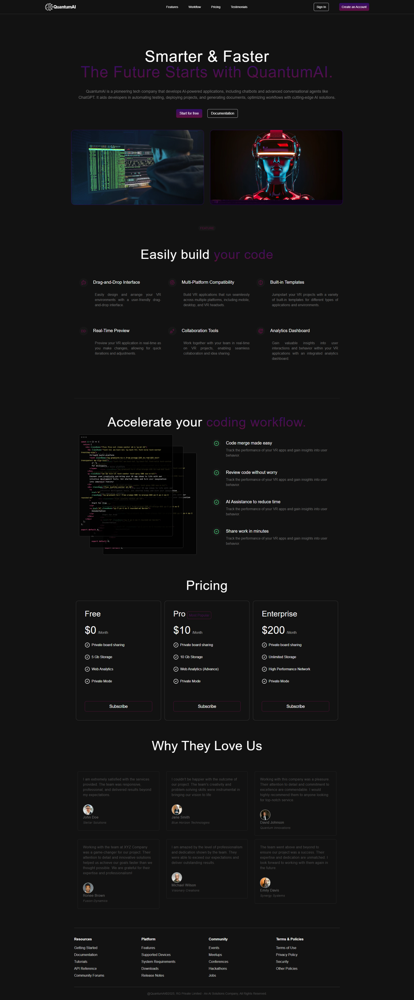

# QuantumAI Landing Page 🚀

## Overview
The QuantumAI Landing Page is a modern, AI-driven, and responsive landing page built using React.js and Tailwind CSS. It serves as the front-facing interface for QuantumAI, an advanced AI-powered platform specializing in automation, chatbot development, and workflow optimization.This landing page is designed to be aesthetically futuristic, highly responsive, and performance-optimized for all devices. The goal of this project is to provide an engaging and interactive user experience while maintaining fast loading speeds, clean UI/UX, and seamless navigation.

## Features
- 🌟 **Modern UI** with dark mode and neon accents
- 📱 **100% Responsive** on all devices
- 💻 **Built with React.js & Tailwind CSS**
- 💳 **Pricing Section** with subscription plans
- ⭐ **Testimonials Section** showcasing user feedback
- ⚡ **Optimized Performance** for fast loading

## Tech Stack
- **React.js** (Frontend)
- **Tailwind CSS** (Styling)

## Screenshot

